---

theme : "night"
transition: "slide"
highlightTheme: "monokai"
# logoImg: "logo.png"
slideNumber: true
title: "MERN Project Overview"

---

### MERN Project Overview

<style>
pre {
  background: #303030;
  padding: 10px 16px;
  border-radius: 0.3em;
  counter-reset: line;
}
pre code[class*="="] .line {
  display: block;
  line-height: 1.8rem;
  font-size: 1em;
}
pre code[class*="="] .line:before {
  counter-increment: line;
  content: counter(line);
  display: inline-block;
  border-right: 1px solid #ddd;
  padding: 0 .5em;
  margin-right: .5em;
  color: #888
}

.reveal .slides > section > section {
  text-align:left; 
}

h1,h2,h3,h4 {
  text-align: center
}

p {
  text-align: center;
}
</style>

---

Yubin, Hsu

TSID / NTAP

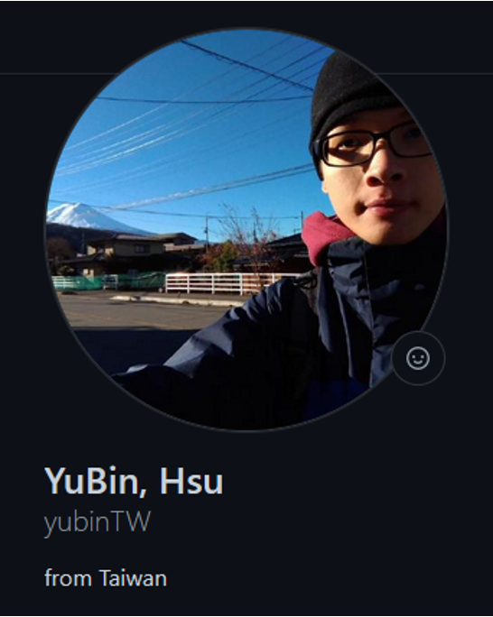

ybhsu@tsmc.com

---

### Outline

- MERN Project Arch.
- Create MERN project from 0 to 1
- Introduction of our product

---

### MERN Project Arch.

- Frontend
  - React
- Backend
  - Fastify
- Database
  - MongoDB


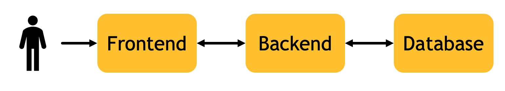

--

### Deployment Strategy

1. Frontend server and Backend server
2. Only Backend server

--

#### 1. Frontend server and Backend server

- Frontend
  - Has its own server to serve the frontend files (HTML, CSS, JavaScript)
  - Listen a port different from backend
- Backend
  - Listen a port different from frontend

--

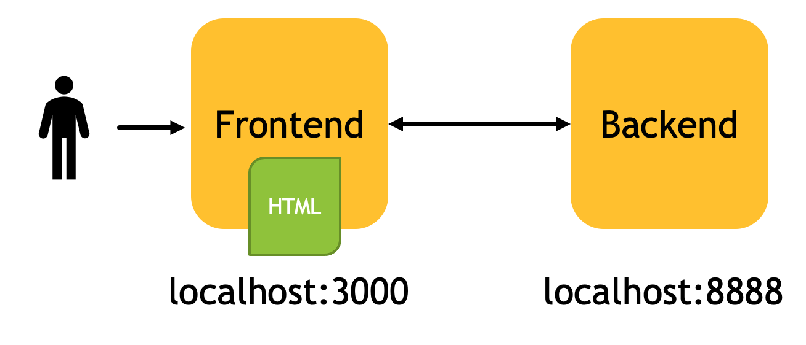

- CORS issue
- User can visit website even backend server is down

--

#### 2. Only Backend Server

- use backend server to serve frontend code

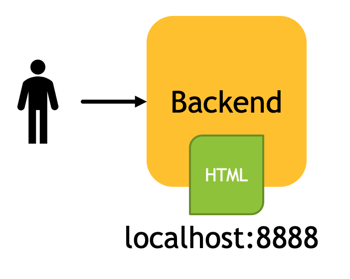

---

### Create MERN Project

--

Environment

- Node v14
- docker (for create MongoDB container)

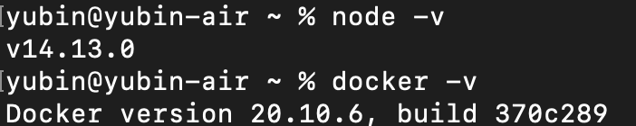

--

Editor

- vscode
- GitPod (https://gitpod.io)

--

- create project folder

```bash=
mkdir myMernProject
cd myMernProject
git init
```

- create backend project

```bash=
mkdir backend
cd backend
npm init
```

--

- Install dependencies of backend project

```bash=
npm i fastify fastify-cors pino-pretty mongoose dotenv
npm i -D typescript @types/node @types/mongoose
npx tsc --init
```

--

edit backend/tsconfig.json

```json=
"include": ["src/**/*.ts"],
"exclude": ["node_modules", ".vscode"],

"compilerOptions": {
  "outDir": "./out",
  "rootDir": "./src", 
}

```

--

create backend/.env

```plaintext
MONGODB_URL=mongodb://localhost:27017
MONGO_DATABASE=mern_demo
FASTIFY_PORT=8888
FASTIFY_ENABLE_LOGGING=true
ENV=dev
```

--

create backend/src/plugins/mongodb.ts

```javascript=
import mongoose from 'mongoose'
import * as dotEnv from 'dotenv'

dotEnv.config()
const host = process.env.MONGO_HOST || 'localhost'
const port = process.env.MONGO_PORT || 27017
const database = process.env.MONGO_DATABASE || 'fastify'

const establishConnection = () => {
  if (!process.env.JEST_WORKER_ID && mongoose.connection.readyState === 0) {
    mongoose.connect(
      `mongodb://${host}:${port}/${database}`,
      { useNewUrlParser: true, useUnifiedTopology: true, useFindAndModify: false },
      (err) => {
        if (!err) console.log('MongoDB connection successful.')
        else console.log('Error in DB connection : ' + JSON.stringify(err, undefined, 2))
      }
    )
  } else {
    console.log('MongoDB has connected.')
  }
}

export { establishConnection }
```

--

create backend/src/server.ts

```typescript=
import fastify, { FastifyInstance, FastifyReply, FastifyRequest } from 'fastify'
import { Server, IncomingMessage, ServerResponse } from 'http'
import { establishConnection } from './plugins/mongodb'

const server: FastifyInstance<Server, IncomingMessage, ServerResponse> = fastify({
    logger: { prettyPrint: true }
})

const startFastify: (port: number) => FastifyInstance<Server, IncomingMessage, ServerResponse> = (port) => {

    server.register(require('fastify-cors'), {})
    
    server.listen(port, (err, _) => {
        if (err) {
            console.error(err)
            process.exit(0)
        }
        establishConnection()
    })

    server.get('/ping', async (request: FastifyRequest, reply: FastifyReply) => {
        return reply.status(200).send({ msg: 'pong' })
    })

    return server
}

export { startFastify }
```

--

create backend/src/index.ts

```typescript=
import { startFastify } from './server'

// Start your server
const server = startFastify(8888)

export { server }
```

--

#### build and run

- make sure you have mongodb

```
docker run -d -p 27017:27017 mongo
```

- build with tsc, run with node

```
tsc
node out/index.js
```

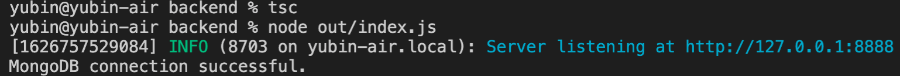

---

visit the endpoint

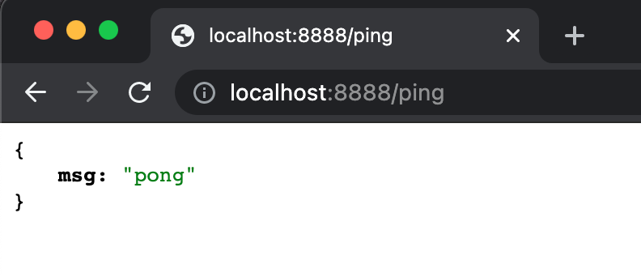

---

Add Mongo Schema

--

create backend/src/models/cat.ts

```typescript=
import { model, Schema } from 'mongoose'

const catSchema: Schema = new Schema(
    {
        name: {
            type: String,
            required: true
        }
    },
    {
        timestamps: true
    }
)

export default model("Cat", catSchema)
```

--

add API endpoint

- edit backend/src/server.ts

```typescript=
import Cat from './models/cat'

server.get('/cats', async (request: FastifyRequest, reply: FastifyReply) => {
    const cats = await Cat.find({}).exec()
    return reply.status(200).send({ cats })
})
```

--

visit the endpoint


--

Create a endpoint for adding data

- edit backend/src/server.ts

```typescript=
server.post('/cats', async (request: FastifyRequest, reply: FastifyReply) => {
    const postBody = request.body
    const cat = await Cat.create(postBody)
    return reply.status(200).send({ cat })
})
```

--

rebuild and rerun

- use API client to send json data
  - Postman
  - curl
  - Thunder Client (vscode extension)

--

Thunder Client

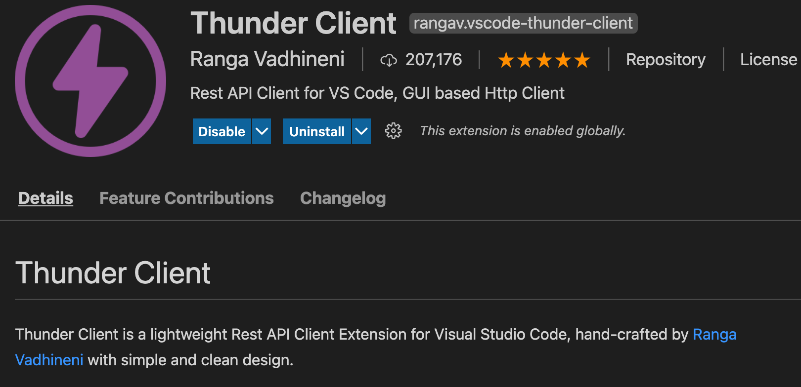

--

POST http://localhost:8888/cats

with json body

```json
{
  "name": "fatOrange"
}
```

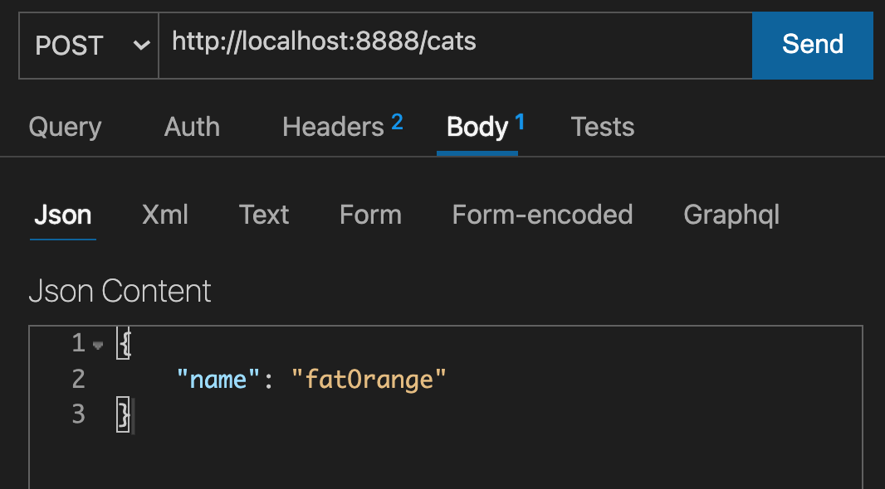

--

Get the response

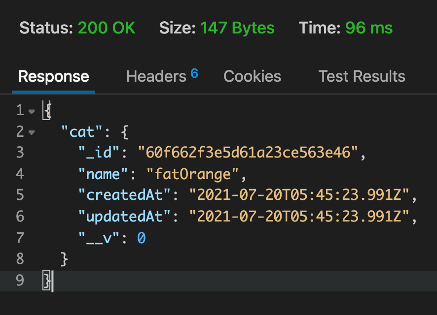

--

Finish API

- GET /cats
- POST /cats

---

Define custom npm scripts

- edit backend/package.json

```json=
"scripts": {
  "build": "tsc",
  "start": "node out/index.js"
},
```

--

Use custom npm script

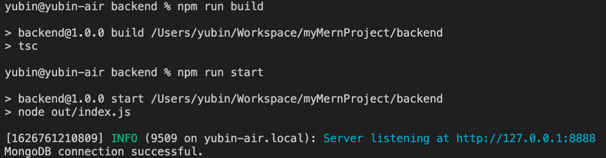

---

Create a Frontend (React) Project

---

Use create-react-app module

https://github.com/facebook/create-react-app

```
cd ..
npx create-react-app frontend --template typescript
```

--

Run the frontend project

```
cd frontend
npm run start
```

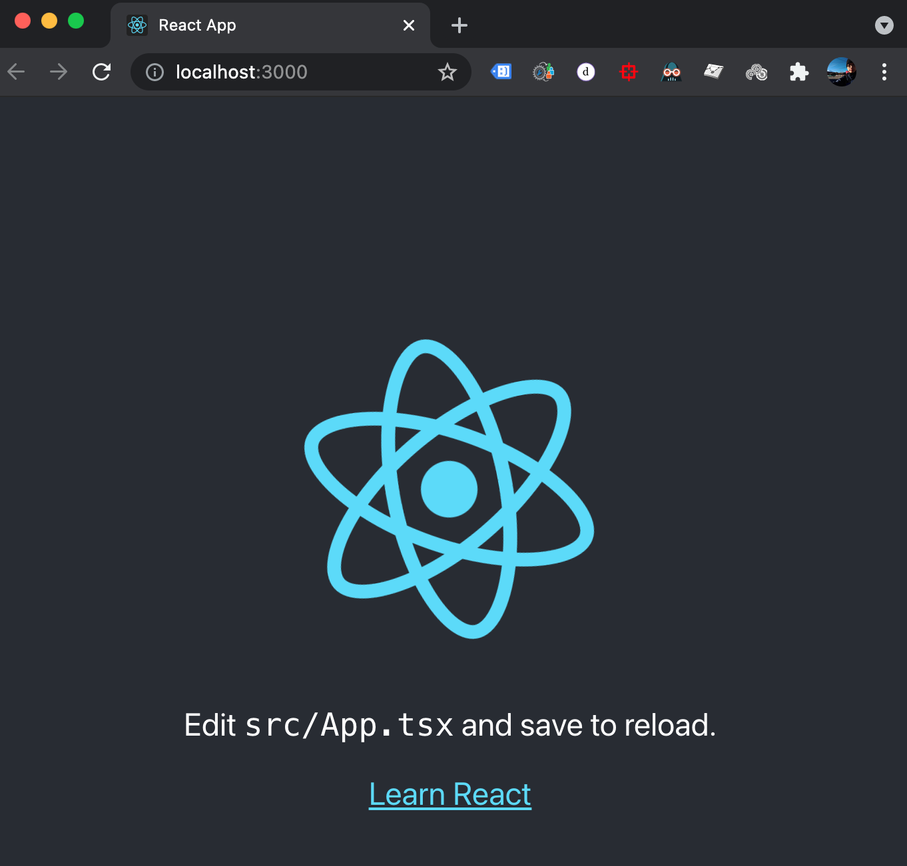


---

Final project repo

https://github.com/yubinTW/MERN-Simple

---

Product X

https://github.com/yubinTW/demo_x

